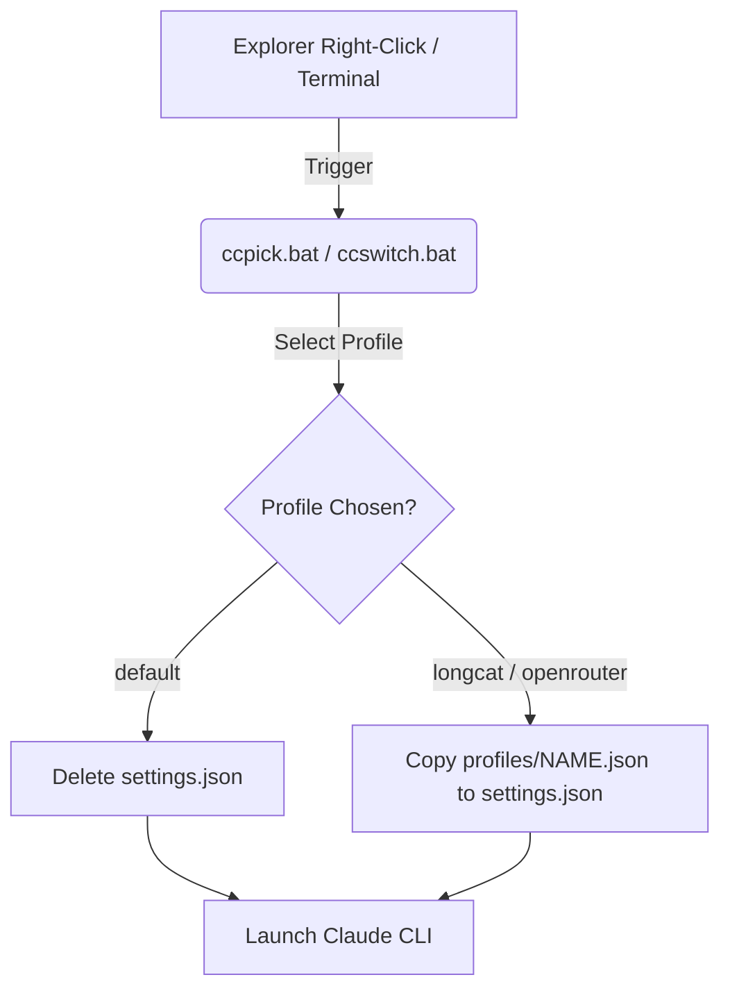

# Technical Code Documentation

This document describes the technical architecture and script implementations for the Claude Code Profile Switcher.

## Overview

The Profile Switcher operates by swapping the active `settings.json` configuration file used by the Claude Code CLI. Since the Claude Code CLI reads settings from `%USERPROFILE%\.claude\settings.json`, we swap this file with pre-configured templates stored in the `profiles/` subdirectory.

---

## Script Implementations

### 1. [ccpick.bat](file:///c:/Users/ADMIN/OneDrive/Documents/GitHub/claude-code-switch/ccpick.bat)

An interactive script executed when launching Claude Code from the Windows Context Menu (or manually).
- **Environment Handling**: Uses `setlocal enabledelayedexpansion` and switches the console code page (`chcp 437`) to handle ASCII border styling.
- **Dynamic Profile Scanning**: Iterates through `%USERPROFILE%\.claude\profiles\*.json` using a `for` loop to dynamically build the selection list.
- **User Prompt**: Reads a numeric input matching the selected profile, copies the profile file to `%USERPROFILE%\.claude\settings.json`, and launches the `claude` command.

### 2. [ccswitch.bat](file:///c:/Users/ADMIN/OneDrive/Documents/GitHub/claude-code-switch/ccswitch.bat)

A command-line tool for switching profiles without launching the `claude` CLI.
- **Argument Check**: Inspects the first command line argument `%1`.
- **Special Cases**: If the argument is `default`, it deletes `%USERPROFILE%\.claude\settings.json` to revert to direct Anthropic API settings.
- **Profile Application**: Validates that the requested `.json` file exists in `%USERPROFILE%\.claude\profiles\`, then overwrites `settings.json` with the profile's contents.

### 3. [install-context-menu.reg](file:///c:/Users/ADMIN/OneDrive/Documents/GitHub/claude-code-switch/install-context-menu.reg)

A Registry entry script that adds a right-click menu option.
- **Keys Updated**:
  - `HKEY_CLASSES_ROOT\Directory\shell\ClaudeCode`: Controls context menu when right-clicking folders.
  - `HKEY_CLASSES_ROOT\Directory\Background\shell\ClaudeCode`: Controls context menu when right-clicking empty space inside folders.
- **Execution Command**: Calls `cmd.exe /k "cd /d "%1" && C:\Users\<Username>\.claude\ccpick.bat"` to navigate to the selected folder and execute the interactive picker.
