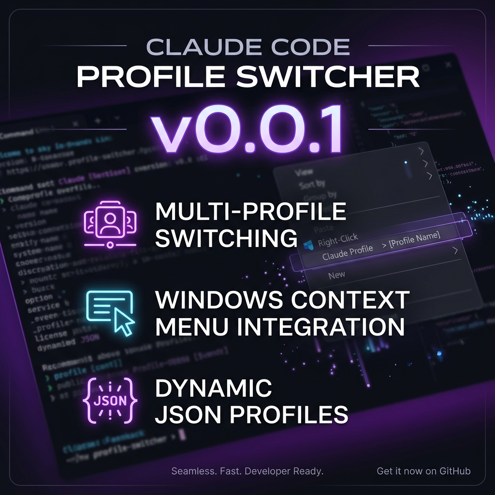

# Claude Code Profile Switcher

[](https://www.gnu.org/licenses/gpl-3.0)

A lightweight Windows setup to switch Claude Code between multiple API providers (OpenRouter, Longcat, Zenmux, DeepSeek, Codestral, direct Anthropic) via a right-click context menu or terminal command.

<p align="center">
  
</p>

---

## What It Does

- Adds an **"Open with Claude Code"** option to the Windows right-click menu on any folder
- Opens a terminal picker listing all profiles in the `profiles/` folder
- Copies the selected profile as `settings.json` and launches Claude Code in that directory
- Also supports a quick terminal command `ccswitch <profilename>` without launching Claude Code
- Adding new profiles requires no changes to any other file

---

## Folder Structure

```
.claude/
├── profiles/
│   ├── codestral (depreciated).json
│   ├── deepseek.json
│   ├── glm.json
│   ├── longcat.json
│   ├── openrouter.json
│   └── zenmux.json
├── ccpick.bat
├── ccswitch.bat
├── install-context-menu.reg
├── uninstall-context-menu.reg
├── claude_v2.ico
└── README.md
```

---

## First-Time Setup

### 1. Copy files to `.claude`

Copy everything from this repo into `C:\Users\ADMIN\.claude\`

Make sure `profiles\` folder and both `.json` files are in place.

### 2. Install the right-click menu entry

- Right-click `install-context-menu.reg` → **Run as administrator**
- Click Yes on the UAC prompt

### 3. Restart Explorer

- Press `Ctrl + Shift + Esc` → Task Manager
- Find **Windows Explorer** → right-click → **Restart**

The "Open with Claude Code" option should now appear when you right-click any folder.

---

## Usage

### Method 1 — Right-click menu (ccpick.bat)

1. Right-click any project folder
2. Click **Open with Claude Code**
3. A terminal opens showing the profile menu:

```
  ==============================
    Claude Code Profile Picker
  ==============================

  [1] codestral (depreciated)
  [2] deepseek
  [3] glm
  [4] longcat
  [5] openrouter
  [6] zenmux
  [0] default (direct Anthropic)

  Pick a profile:
```

4. Type the number and press Enter
5. Claude Code launches in that folder with the selected profile

---

### Method 2 — Terminal command (ccswitch.bat)

Use this when you want to switch the active profile without launching Claude Code, or from an already open terminal.

```cmd
ccswitch "codestral (depreciated)"
ccswitch deepseek
ccswitch glm
ccswitch longcat
ccswitch openrouter
ccswitch zenmux
ccswitch default
```

`ccswitch default` removes `settings.json` entirely, reverting to direct Anthropic.

**Note:** Named `ccswitch` (not `switch`) to avoid conflict with PowerShell's reserved `switch` keyword. Works in both CMD and PowerShell.

To use it from anywhere, add `C:\Users\ADMIN\.claude` to your system PATH:
- `Win + R` → `sysdm.cpl` → Advanced → Environment Variables
- Under System variables → find **Path** → Edit → New → paste `C:\Users\ADMIN\.claude`
- Click OK and reopen your terminal

---

## Adding a New Profile

1. Create a new `.json` file in `C:\Users\ADMIN\.claude\profiles\`
2. That's it — it appears in the menu automatically next time

### Profile template

```json
{
  "env": {
    "ANTHROPIC_BASE_URL": "https://your-provider-api-url",
    "ANTHROPIC_AUTH_TOKEN": "your-api-key",
    "ANTHROPIC_API_KEY": "",
    "ANTHROPIC_MODEL": "provider/model-name",
    "ANTHROPIC_SMALL_FAST_MODEL": "provider/model-name",
    "ANTHROPIC_DEFAULT_SONNET_MODEL": "provider/model-name",
    "ANTHROPIC_DEFAULT_OPUS_MODEL": "provider/model-name"
  }
}
```

### Longcat profile (`longcat.json`)

```json
{
  "env": {
    "ANTHROPIC_AUTH_TOKEN": "your_longcat_key",
    "ANTHROPIC_BASE_URL": "https://api.longcat.chat/anthropic",
    "ANTHROPIC_MODEL": "LongCat-2.0-Preview",
    "ANTHROPIC_SMALL_FAST_MODEL": "LongCat-2.0-Preview",
    "ANTHROPIC_DEFAULT_SONNET_MODEL": "LongCat-2.0-Preview",
    "ANTHROPIC_DEFAULT_OPUS_MODEL": "LongCat-2.0-Preview",
    "CLAUDE_CODE_DISABLE_NONESSENTIAL_TRAFFIC": 1
  }
}
```

### OpenRouter profile (`openrouter.json`)

```json
{
  "env": {
    "ANTHROPIC_BASE_URL": "https://openrouter.ai/api",
    "ANTHROPIC_AUTH_TOKEN": "sk-or-v1-your_openrouter_key",
    "ANTHROPIC_API_KEY": "",
    "ANTHROPIC_MODEL": "google/gemini-2.5-flash",
    "ANTHROPIC_SMALL_FAST_MODEL": "google/gemini-2.5-flash",
    "ANTHROPIC_DEFAULT_SONNET_MODEL": "google/gemini-2.5-flash",
    "ANTHROPIC_DEFAULT_OPUS_MODEL": "google/gemini-2.5-flash"
  }
}
```

### Zenmux profile (`zenmux.json`)

```json
{
  "env": {
    "ZENMUX_API_KEY": "your_zenmux_api_key",
    "ANTHROPIC_BASE_URL": "https://zenmux.ai/api/anthropic",
    "ANTHROPIC_AUTH_TOKEN": "your_zenmux_api_key",
    "ANTHROPIC_API_KEY": "",
    "ANTHROPIC_MODEL": "z-ai/glm-5.2-free",
    "ANTHROPIC_SMALL_FAST_MODEL": "z-ai/glm-4.7-flash-free",
    "ANTHROPIC_DEFAULT_SONNET_MODEL": "stepfun/step-3.7-flash-free",
    "ANTHROPIC_DEFAULT_OPUS_MODEL": "z-ai/glm-5.2-free"
  },
  "theme": "dark"
}
```

### DeepSeek profile (`deepseek.json`)

```json
{
  "env": {
    "ANTHROPIC_BASE_URL": "https://api.deepseek.com/anthropic",
    "ANTHROPIC_AUTH_TOKEN": "<your DeepSeek API Key>",
    "ANTHROPIC_API_KEY": "",
    "ANTHROPIC_MODEL": "deepseek-v4-pro[1m]",
    "ANTHROPIC_DEFAULT_OPUS_MODEL": "deepseek-v4-pro[1m]",
    "ANTHROPIC_DEFAULT_SONNET_MODEL": "deepseek-v4-pro[1m]",
    "ANTHROPIC_DEFAULT_HAIKU_MODEL": "deepseek-v4-flash",
    "CLAUDE_CODE_SUBAGENT_MODEL": "deepseek-v4-flash",
    "CLAUDE_CODE_DISABLE_NONESSENTIAL_TRAFFIC": "1",
    "CLAUDE_CODE_EFFORT_LEVEL": "max"
  }
}
```

### GLM profile (`glm.json`)

```json
{
  "env": {
    "ANTHROPIC_AUTH_TOKEN": "your_glm_auth_token",
    "ANTHROPIC_BASE_URL": "https://api.z.ai/api/anthropic",
    "API_TIMEOUT_MS": "3000000",
    "ANTHROPIC_DEFAULT_HAIKU_MODEL": "glm-4.5-flash",
    "ANTHROPIC_DEFAULT_SONNET_MODEL": "glm-4.7-flash",
    "ANTHROPIC_DEFAULT_OPUS_MODEL": "glm-4.7-flash"
  }
}
```

### Codestral profile (depreciated) (`codestral (depreciated).json`)

```json
{
  "env": {
    "CODESTRAL_API_KEY": "",
    "ANTHROPIC_BASE_URL": "https://codestral.mistral.ai/v1/chat/completions",
    "ANTHROPIC_AUTH_TOKEN": "",
    "ANTHROPIC_API_KEY": "",
    "ANTHROPIC_MODEL": "codestral-2508",
    "ANTHROPIC_SMALL_FAST_MODEL": "codestral-2508",
    "ANTHROPIC_DEFAULT_SONNET_MODEL": "codestral-2508",
    "ANTHROPIC_DEFAULT_OPUS_MODEL": "codestral-2508"
  }
}
```

---

## Uninstalling the Right-Click Entry

- Double-click `uninstall-context-menu.reg` → Yes
- Restart Explorer via Task Manager

---

## Re-installing on a New Machine

1. Copy this repo to `C:\Users\<YourUsername>\.claude\`
2. Open `install-context-menu.reg` in Notepad and replace `ADMIN` with your actual Windows username throughout
3. Run as administrator and restart Explorer

---

## Troubleshooting

| Problem | Fix |
|---|---|
| Right-click option not showing | Restart Explorer via Task Manager, or reboot |
| "The system cannot find the path" | Username in `.reg` file doesn't match — re-check and re-install |
| Explorer crashes on click | Re-install the `.reg` as administrator after uninstalling first |
| Garbled box characters in terminal | `chcp 437` line in `ccpick.bat` handles this — ensure it's present |
| `ccswitch` not recognized | Add `C:\Users\ADMIN\.claude` to system PATH and reopen terminal |
| PowerShell says `switch` is reserved | Use `ccswitch.bat` — file must be named `ccswitch.bat` not `switch.bat` |
| Charged models on OpenRouter | Set all four model env vars explicitly, use `:free` suffix |
| Profile not appearing in menu | Ensure file is `.json` extension and is inside the `profiles\` folder |

---
